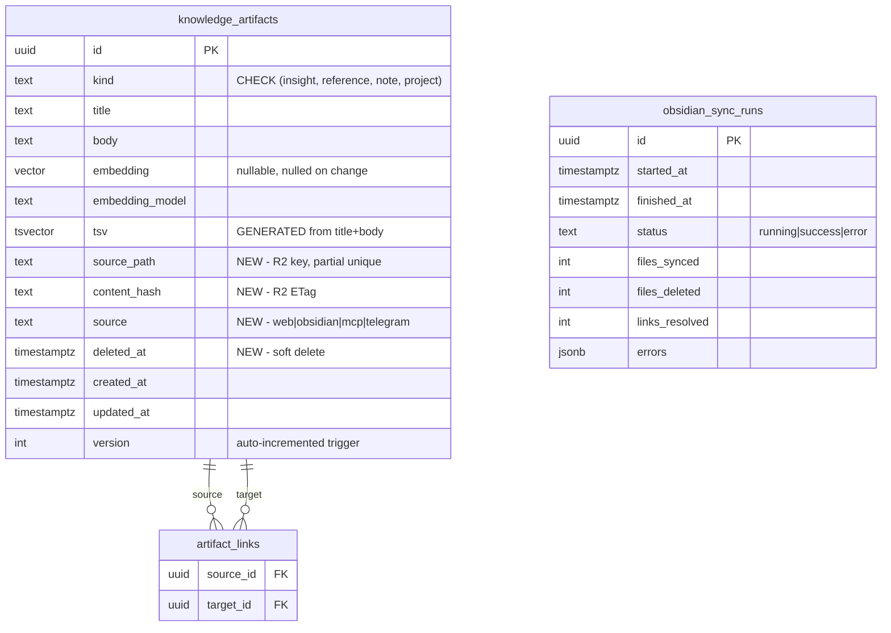

# feat: Obsidian Vault Sync via R2

## Enhancement Summary

**Deepened on:** 2026-03-19
**Agents used:** TypeScript reviewer, Security sentinel, Performance oracle, Data integrity guardian, Architecture strategist, Code simplicity reviewer, Data migration expert, Pattern recognition specialist, Agent-native reviewer, Best practices researcher

### Key Improvements
1. **Migration hardened** — safety UPDATE before constraint swap, `IF EXISTS` on DROP, CHECK on source column, functional index on `lower(title)`
2. **Performance at scale** — batch wiki link resolution via in-memory Map, array-based anti-join for soft-delete, file size limit, download concurrency cap
3. **Architecture refined** — atomicity assessment extracted to separate module as post-sync callback, `gray-matter` for YAML parsing with zod validation
4. **Agent-native parity** — `source` filter added to existing artifact tools, `get_artifact` extended with links/backlinks, Telegram system prompt updated
5. **Security** — YAML safe schema, file size bounds, HTML escaping in Telegram notifications, source guard at query level

### New Considerations Discovered
- Soft-delete must also filter `getExplicitLinks`, `getExplicitBacklinks`, and `getArtifactGraph` (all 4 sub-queries)
- R2 ETags come wrapped in quotes — strip before comparing
- Strip fenced code blocks before wiki link extraction to avoid false positives
- Advisory lock should ideally use a dedicated pool client for lock/unlock pair
- Soft-delete step should run based on R2 listing, not sync success set (avoid false soft-deletes on partial failures)

---

## Overview

Sync Obsidian markdown notes from Cloudflare R2 (written by Remotely Save plugin) into `knowledge_artifacts`, with wiki link resolution, soft-delete, and atomicity nudges via Telegram.

## Problem Statement / Motivation

Journal entries live in Day One, but knowledge notes (insights, references, project docs) have no home. Obsidian is the natural tool for atomic note-taking, but notes trapped in a local vault can't be searched semantically, linked to journal entries, or surfaced by the Telegram agent. Syncing the vault into the existing artifact system unlocks hybrid search (semantic + BM25 + graph traversal) over personal knowledge.

## Proposed Solution

An in-process cron (30-min interval, advisory lock) that:
1. Lists all `.md` files in the R2 `"artifacts"` bucket
2. Diffs by ETag to detect changes
3. Upserts into `knowledge_artifacts` with embedding nullification
4. Resolves `[[wiki links]]` into `artifact_links`
5. Soft-deletes removed files
6. Nudges via Telegram when notes appear non-atomic

(see brainstorm: `docs/brainstorms/2026-03-19-obsidian-r2-sync-brainstorm.md`)

## Technical Approach

### Phase 1: Schema Migration + Kind Simplification

**Migration `033-obsidian-vault-sync`:**

```sql
-- Safety: remap any straggler kinds before tightening constraint
UPDATE knowledge_artifacts SET kind = 'note' WHERE kind IN ('theory', 'model', 'log');

-- Add columns for Obsidian sync
ALTER TABLE knowledge_artifacts ADD COLUMN source_path TEXT;
ALTER TABLE knowledge_artifacts ADD COLUMN content_hash TEXT;
ALTER TABLE knowledge_artifacts ADD COLUMN source TEXT NOT NULL DEFAULT 'web'
  CHECK (source IN ('web', 'obsidian', 'mcp', 'telegram'));
ALTER TABLE knowledge_artifacts ADD COLUMN deleted_at TIMESTAMPTZ;

-- Partial unique index for R2-sourced artifacts
CREATE UNIQUE INDEX idx_artifacts_source_path
  ON knowledge_artifacts (source_path)
  WHERE source_path IS NOT NULL;

-- Functional index for case-insensitive title lookups (wiki link resolution)
CREATE INDEX idx_artifacts_title_lower
  ON knowledge_artifacts (lower(title));

-- Update kind constraint
ALTER TABLE knowledge_artifacts DROP CONSTRAINT IF EXISTS knowledge_artifacts_kind_check;
ALTER TABLE knowledge_artifacts ADD CONSTRAINT knowledge_artifacts_kind_check
  CHECK (kind IN ('insight', 'reference', 'note', 'project'));

-- Sync runs tracking (follows oura_sync_runs pattern)
CREATE TABLE IF NOT EXISTS obsidian_sync_runs (
  id UUID PRIMARY KEY DEFAULT gen_random_uuid(),
  started_at TIMESTAMPTZ NOT NULL DEFAULT NOW(),
  finished_at TIMESTAMPTZ,
  status TEXT NOT NULL DEFAULT 'running' CHECK (status IN ('running', 'success', 'error')),
  files_synced INT NOT NULL DEFAULT 0,
  files_deleted INT NOT NULL DEFAULT 0,
  links_resolved INT NOT NULL DEFAULT 0,
  errors JSONB NOT NULL DEFAULT '[]'::jsonb
);

CREATE INDEX idx_sync_runs_started ON obsidian_sync_runs (started_at DESC);
```

### Research Insights (Phase 1)

**Migration safety (Data Migration Expert + Data Integrity Guardian):**
- Safety `UPDATE` before constraint swap prevents migration failure if any rows use dropped kinds
- `DROP CONSTRAINT IF EXISTS` matches pattern in migrations 019 and 025 — handles partial re-runs
- `ADD COLUMN ... NOT NULL DEFAULT 'web'` does NOT trigger table rewrite on PG 11+ (lazy backfill via `pg_attribute.attmissingval`)
- Index creation without `CONCURRENTLY` takes ACCESS EXCLUSIVE lock — fine at current table size (<1000 rows)
- `CHECK (source IN (...))` prevents invalid values at DB level (mirrors `entries.source` pattern)
- `lower(title)` functional index needed for wiki link resolution — without it, each `resolveArtifactTitleToId` call does a sequential scan

**Rollback SQL (if needed):**
```sql
ALTER TABLE knowledge_artifacts DROP CONSTRAINT IF EXISTS knowledge_artifacts_kind_check;
ALTER TABLE knowledge_artifacts ADD CONSTRAINT knowledge_artifacts_kind_check
  CHECK (kind IN ('insight', 'theory', 'model', 'reference', 'note', 'log'));
-- New columns (source_path, content_hash, source, deleted_at) can stay — they're additive
DROP TABLE IF EXISTS obsidian_sync_runs;
```

**Verification SQL (run before migration in production):**
```sql
SELECT kind, COUNT(*) FROM knowledge_artifacts GROUP BY kind ORDER BY kind;
-- Expected: only 'insight' rows
```

**Update kind constants across the codebase (lockstep):**

| File | Change |
|------|--------|
| `specs/schema.sql` | CHECK constraint + new columns + new table |
| `specs/tools.spec.ts` | `z.enum` for kind params |
| `src/db/queries/artifacts.ts` | `ArtifactKind` type + add `source`, `deleted_at` to `ArtifactRow` |
| `src/transports/routes/artifacts.ts` | `artifactKindSchema` |
| `web/src/constants/artifacts.ts` | `ARTIFACT_KINDS`, labels, badge colors |
| `packages/shared/` | If kind type is re-exported |

**Files:**
- `scripts/migrate.ts` — add migration `033-obsidian-vault-sync`
- `specs/schema.sql` — canonical schema update

### Phase 2: Soft-Delete Query Filters

Add `AND deleted_at IS NULL` to all artifact queries. **Complete enumeration:**

In `src/db/queries/artifacts.ts`:
- `listArtifacts`
- `countArtifacts`
- `searchArtifacts` (both `semantic` and `fulltext` CTEs)
- `searchArtifactsKeyword`
- `listArtifactTitles`
- `listArtifactTags`
- `resolveArtifactTitleToId`
- `findSimilarArtifacts`
- `getExplicitLinks` (join target must be non-deleted)
- `getExplicitBacklinks` (join source must be non-deleted)
- `getArtifactGraph` (all 4 parallel sub-queries)

In `src/db/queries/content-search.ts`:
- `searchContent` (artifact branch — both semantic and fulltext CTEs)

In `scripts/embed-entries.ts`:
- Add `AND deleted_at IS NULL` to artifact embedding query — don't waste OpenAI calls on soft-deleted notes

**Exceptions:**
- `getArtifactById` does NOT filter `deleted_at` — returns any artifact by ID (for debugging, direct links). Add `deleted_at` and `source` fields to `ArtifactRow` so callers can distinguish.

### Research Insights (Phase 2)

**Soft-delete best practices (Data Integrity Guardian + Best Practices):**
- Per-query filter is the right approach over DB views (can't use `ON CONFLICT` on views) or row-level security (complex, performance overhead)
- `deleteArtifact` (line 492) currently does hard DELETE — keep hard delete for web-originated deletes, soft-delete only for Obsidian sync. Soft-delete does NOT trigger CASCADE on `artifact_links`, so links to soft-deleted artifacts would become orphaned. The explicit links filter (`getExplicitLinks`/`getExplicitBacklinks`) handles this.
- Optional future optimization: partial index `CREATE INDEX idx_artifacts_active ON knowledge_artifacts (updated_at DESC) WHERE deleted_at IS NULL` — not needed at current scale but useful if soft-deleted rows exceed 20% of total

**Files:**
- `src/db/queries/artifacts.ts`
- `src/db/queries/content-search.ts`
- `scripts/embed-entries.ts`

### Phase 3: R2 Client Extensions

Add `ListObjectsV2` and `GetObject` to `src/storage/r2.ts`:

```typescript
/** Metadata for an R2 object from ListObjectsV2 */
export interface R2ObjectMeta {
  key: string;
  etag: string;
  size: number;
}

// List all objects in a bucket, handling pagination (>1000 files)
export async function listAllObjects(
  client: S3Client,
  bucket: string,
  prefix?: string
): Promise<R2ObjectMeta[]> {
  const results: R2ObjectMeta[] = [];
  let continuationToken: string | undefined;
  do {
    const response = await client.send(
      new ListObjectsV2Command({
        Bucket: bucket,
        Prefix: prefix,
        ContinuationToken: continuationToken,
      })
    );
    for (const obj of response.Contents ?? []) {
      if (obj.Key && obj.ETag) {
        results.push({
          key: obj.Key,
          etag: obj.ETag.replace(/"/g, ""),  // Strip surrounding quotes
          size: obj.Size ?? 0,
        });
      }
    }
    continuationToken = response.IsTruncated
      ? response.NextContinuationToken
      : undefined;
  } while (continuationToken);
  return results;
}

// Download object content as UTF-8 string
export async function getObjectContent(
  client: S3Client,
  bucket: string,
  key: string
): Promise<string> {
  const response = await client.send(
    new GetObjectCommand({ Bucket: bucket, Key: key })
  );
  return await response.Body!.transformToString("utf-8");
}
```

### Research Insights (Phase 3)

**R2/S3 best practices (Best Practices + Security):**
- R2 ETags come wrapped in quotes (`"abc123"`) — must strip before comparing against stored `content_hash`
- `Size` captured from listing for file size enforcement (skip files >1MB — see Phase 5)
- Named interface `R2ObjectMeta` instead of anonymous `{ key, etag }` for type clarity
- Alternative: AWS SDK v3 ships `paginateListObjectsV2` async generator, but manual loop is more explicit and matches codebase style
- These generic S3 operations can live in `src/storage/r2.ts` — they extend the existing thin wrapper without changing its purpose

**Files:**
- `src/storage/r2.ts`

### Phase 4: Markdown Parser

New module `src/obsidian/parser.ts`. **Use `gray-matter` for frontmatter parsing** — battle-tested (5B+ npm downloads), handles YAML edge cases, strips `---` delimiters correctly even when `---` appears in body content.

```typescript
import matter from "gray-matter";

interface ParsedNote {
  title: string;
  body: string;
  kind: ArtifactKind;
  tags: string[];
  wikiLinks: string[];
}

// Zod schema for frontmatter validation
const frontmatterSchema = z.object({
  kind: z.enum(["insight", "reference", "note", "project"]).default("note"),
  tags: z.union([z.array(z.string()), z.string().transform((s) => [s])]).default([]),
}).passthrough();

export function parseObsidianNote(content: string, filename: string): ParsedNote {
  const { data, content: markdownBody } = matter(content);
  const fm = frontmatterSchema.safeParse(data);
  const kind = fm.success ? fm.data.kind : "note";
  const tags = fm.success ? normalizeTags(fm.data.tags) : [];
  const title = extractTitle(markdownBody) ?? filenameStem(filename);
  const body = stripFirstHeading(markdownBody).trim() || title;
  const wikiLinks = extractWikiLinks(markdownBody);
  return { title: title.slice(0, 300), body, kind, tags, wikiLinks };
}
```

**Wiki link extraction** — pure function, extracted to `src/obsidian/wiki-links.ts` for independent testing:

```typescript
const FENCED_CODE_RE = /```[\s\S]*?```/g;
const INLINE_CODE_RE = /`[^`]+`/g;
const WIKILINK_RE = /!?\[\[([^\]]+)\]\]/g;

export function extractWikiLinks(content: string): string[] {
  // Strip code blocks to avoid false positives
  const cleaned = content.replace(FENCED_CODE_RE, "").replace(INLINE_CODE_RE, "");
  const seen = new Set<string>();
  const results: string[] = [];
  for (const match of cleaned.matchAll(WIKILINK_RE)) {
    let target = match[1];
    const pipeIdx = target.indexOf("|");
    if (pipeIdx !== -1) target = target.substring(0, pipeIdx);
    const hashIdx = target.indexOf("#");
    if (hashIdx !== -1) target = target.substring(0, hashIdx);
    target = target.trim();
    if (target.length > 0 && !seen.has(target)) {
      seen.add(target);
      results.push(target);
    }
  }
  return results;
}
```

### Research Insights (Phase 4)

**YAML parsing (Security + TypeScript + Best Practices):**
- `gray-matter` bundles `js-yaml` with safe defaults — no `!!js/function` or prototype pollution risk
- Zod schema validates frontmatter immediately after parsing — invalid `kind` defaults to `"note"` via `.default()`, no runtime surprise
- `z.union([array, string.transform])` handles both `tags: [a, b]` and `tags: a` YAML forms
- `.passthrough()` allows extra frontmatter fields (aliases, cssclass, date) without error — they're ignored

**Wiki link regex (Best Practices):**
- `\[\[([^\]]+)\]\]` is ReDoS-safe — no backtracking ambiguity in `[^\]]+`
- Code block stripping prevents false positives from `[[links]]` inside code examples
- `!?` prefix captures both `[[link]]` and `![[embed]]` — embeds treated as links for graph purposes

**Dependencies:**
- Add `gray-matter` to `package.json` (+ `@types/gray-matter` for TypeScript types)

**Files:**
- `src/obsidian/parser.ts` (new)
- `src/obsidian/wiki-links.ts` (new — pure function, independently testable)

### Phase 5: Sync Engine

New module `src/obsidian/sync.ts`, following the Oura sync pattern:

```typescript
const LOCK_KEY = 9152202;
const VAULT_BUCKET = "artifacts";
const MAX_NOTE_BYTES = 1_048_576; // 1MB — skip oversized files

export function startObsidianSyncTimer(
  pool: pg.Pool
): NodeJS.Timeout | null;
```

**Sync algorithm:**

```
1. Acquire advisory lock via dedicated pool client (pg_try_advisory_lock)
2. Record sync run (INSERT INTO obsidian_sync_runs)
3. List ALL objects from R2 (paginated via listAllObjects)
4. Filter: keep only .md files, skip .obsidian/*, .trash/*, files > 1MB
5. Load all existing source_path + content_hash from DB WHERE source = 'obsidian'
6. Partition into: new, changed (ETag mismatch), unchanged
7. Download new + changed files (parallel with concurrency cap of 10)
8. Parse each file (per-file try/catch — errors accumulated, not fatal)
9. Upsert artifacts:
   - ON CONFLICT (source_path) WHERE source_path IS NOT NULL DO UPDATE SET
     title, body, kind, source, content_hash,
     embedding = NULL, deleted_at = NULL
   - For new: INSERT with source = 'obsidian'
10. Sync tags for each upserted artifact (delete + reinsert, same as updateArtifact)
11. Soft-delete (based on full R2 listing, NOT sync success set):
    UPDATE SET deleted_at = NOW(), embedding = NULL
    WHERE source = 'obsidian'
      AND deleted_at IS NULL
      AND NOT (source_path = ANY($1::text[]))
12. Resolve wiki links (pass 2):
    - Load ALL artifact titles + source_paths into in-memory Map (single query)
    - For each upserted artifact, resolve wiki link targets in-memory:
      a. Title match (case-insensitive)
      b. Source path filename stem match (case-insensitive)
    - Call syncExplicitLinks() per artifact
    - Log unresolvable links
13. Post-sync: atomicity assessment callback (new + changed only)
14. Update sync run record (finished_at, status, counts)
15. Release advisory lock (same dedicated client)
```

**Per-file error handling:** each file is parsed and upserted in its own try/catch. Errors are accumulated as `{ file: string, error: string }[]` and stored in `obsidian_sync_runs.errors`. The sync continues processing remaining files.

### Research Insights (Phase 5)

**Performance (Performance Oracle):**
- **Soft-delete with NOT IN**: don't use `NOT IN (list)` with thousands of keys — PG switches to seq scan. Use `NOT (source_path = ANY($1::text[]))` which handles arrays better for parameterized queries
- **Wiki link resolution**: loading all titles into an in-memory Map converts O(n*l) DB queries into a single query + in-memory lookups. For 500 artifacts with 3 links each, this saves 1,500 round trips
- **Download concurrency**: cap at 10 parallel `GetObjectCommand` calls to avoid exhausting memory and R2 connection limits. Use a simple semaphore or process in batches of 10.
- **Tag sync**: existing `upsertArtifactTags` does 2 queries per tag (O(n*t)). At 500 files x 3 tags = 3,000 round trips. Consider batch optimization in future, but acceptable at current scale.

**Data integrity (Data Integrity Guardian):**
- Soft-delete must run based on **full R2 listing** (all vault files), not the set of successfully synced files. If some upserts fail, we still know which files exist in the vault — don't soft-delete files that exist but failed to sync.
- `ON CONFLICT (source_path) WHERE source_path IS NOT NULL` — must include the WHERE clause for partial unique index, otherwise PG returns "no unique or exclusion constraint" error
- Version bump trigger fires on every UPDATE — the ETag check prevents no-op updates (only upsert if hash differs), so version stays stable for unchanged files

**Security (Security Sentinel):**
- **File size limit**: skip files > 1MB with a warning in errors. Prevents memory exhaustion from oversized or binary files with `.md` extension
- **Advisory lock**: use `pool.connect()` for a dedicated client — `pool.query()` may use different connections for lock/unlock. The Oura sync uses `pool.query()` which works in practice but isn't guaranteed.

**Files:**
- `src/obsidian/sync.ts` (new)
- `src/db/queries/obsidian.ts` (new — sync run CRUD, bulk source_path queries)
- Add `export * from "./obsidian.js"` to `src/db/queries/index.ts`

### Phase 6: Atomicity Nudges

**Extracted to separate module** `src/obsidian/atomicity.ts` (Architecture Strategist recommendation — keeps sync engine focused on data pipeline, atomicity is a separate concern):

```typescript
interface AtomicityResult {
  atomic: boolean;
  reason: string;
  suggestedSplits?: string[];
}

const atomicityResponseSchema = z.object({
  atomic: z.boolean(),
  reason: z.string(),
  suggestedSplits: z.array(z.string()).optional(),
});

export async function assessAtomicity(
  title: string,
  body: string
): Promise<AtomicityResult | null>;
```

**Wired as a post-sync callback** (similar to Oura's `onAfterSync`):

```typescript
// In sync engine, after all upserts and link resolution:
if (changedNotes.length > 0) {
  void assessAndNotify(changedNotes).catch((err) =>
    notifyError("Obsidian atomicity", err)
  );
}
```

### Research Insights (Phase 6)

**Architecture (Architecture Strategist):**
- Separating atomicity from sync keeps the sync engine testable without mocking the Anthropic SDK
- Fire-and-forget via `void ... .catch()` — LLM failures never block the sync
- Matches the insight engine pattern: background analysis that produces Telegram notifications

**Type safety (TypeScript reviewer):**
- Zod schema validates the LLM's JSON response — LLMs return strings, parse can fail, shape can be unexpected
- Named `AtomicityResult` interface instead of inline type

**Cost + latency (Performance Oracle):**
- Parallelize assessments with concurrency of 5 (not unbounded) — 100 notes at ~300ms each = ~6s with concurrency 5
- At ~$0.25/MTok input for Haiku, 100 notes x 500 tokens = ~$0.013 per sync. Negligible.

**Dedup:** only assess when `content_hash` changes. The sync already skips unchanged files (ETag match), so assessments only fire on actual edits.

**Batching:** all non-atomic notes in one sync cycle → single Telegram message with suggested split points. HTML-escape note content in the notification.

**Important:** the atomicity assessment is purely advisory — the note is always synced regardless. The nudge informs the user, who can then edit in Obsidian. Remotely Save pushes the edit to R2, and the next sync cycle picks up the change automatically.

**Files:**
- `src/obsidian/atomicity.ts` (new)

### Phase 7: Web UI Source Guard

Prevent edits to Obsidian-sourced artifacts:

**API layer (defense in depth):**
- `PUT /api/artifacts/:id` — return 403 if `source = 'obsidian'` with message "This artifact is synced from Obsidian. Edit in Obsidian instead."
- `DELETE /api/artifacts/:id` — return 403 if `source = 'obsidian'` with message "This artifact is synced from Obsidian. Delete from your vault instead."

**Query layer (defense in depth):**
```typescript
// In updateArtifact, after fetching current row:
if (currentRow.source === 'obsidian') return 'source_protected';
```

**Web UI:**
- Show a read-only banner on obsidian-sourced artifact detail/edit pages
- Hide edit/delete buttons when `source === 'obsidian'`

**Files:**
- `src/transports/routes/artifacts.ts` — API guards
- `src/db/queries/artifacts.ts` — query-level guard in `updateArtifact`
- `web/src/pages/` — read-only mode for obsidian artifacts

### Phase 8: MCP Tools + Agent-Native Parity

**New tools:**

**`sync_obsidian_vault`** — manual trigger (with optional single-file resync):

```typescript
sync_obsidian_vault: {
  name: "sync_obsidian_vault" as const,
  annotations: WRITE_IDEMPOTENT,
  description: "Manually trigger Obsidian vault sync from R2. Optionally sync a single file by path.",
  params: z.object({
    file_path: z.string().optional().describe("Sync only this file (vault-relative path)"),
  }),
  examples: [
    { input: {}, behavior: "Full vault sync" },
    { input: { file_path: "notes/dopamine.md" }, behavior: "Sync single file" },
  ],
}
```

**`get_obsidian_sync_status`** — status check:

```typescript
get_obsidian_sync_status: {
  name: "get_obsidian_sync_status" as const,
  annotations: READ_ONLY,
  description: "Get Obsidian vault sync status: last run, file count, pending embeddings, unresolved wiki links",
  params: z.object({}),
  examples: [{ input: {}, behavior: "Returns sync status summary" }],
}
```

**Enhancements to existing tools (Agent-Native Parity):**

| Tool | Enhancement |
|------|-------------|
| `list_artifacts` | Add optional `source` filter param (`z.enum(['web', 'obsidian', 'mcp', 'telegram']).optional()`) |
| `search_artifacts` | Add optional `source` filter param |
| `search_content` | Add optional `source` filter param |
| `get_artifact` | Include `links` (forward) and `backlinks` arrays in response, using existing `getExplicitLinks`/`getExplicitBacklinks` |

### Research Insights (Phase 8)

**Agent-native parity (Agent-Native Reviewer):**
- Without `source` filter, agents can't scope queries to "show me my obsidian notes about X" — the data exists but is undiscoverable by source
- `get_artifact` already has the query layer for links/backlinks (`getExplicitLinks`, `getExplicitBacklinks`) — just wire them into the response
- Single-file resync via `file_path` param lets agents do "I just updated my note on X, re-sync it" without triggering a full vault sync
- Unresolved wiki link count in status tool surfaces knowledge graph gaps

**Telegram system prompt update:**
- Add to `src/telegram/agent/context.ts`: "You also have access to knowledge artifacts — notes, insights, and references. Some are synced from the user's Obsidian vault. Use `search_artifacts` or `search_content` to find them."

**Files:**
- `specs/tools.spec.ts` — new tools + updated existing tool specs
- `src/tools/sync-obsidian-vault.ts` (new)
- `src/tools/get-obsidian-sync-status.ts` (new)
- `src/tools/list-artifacts.ts` — thread `source` filter
- `src/tools/search-artifacts.ts` — thread `source` filter
- `src/tools/search-content.ts` — thread `source` filter
- `src/tools/get-artifact.ts` — add links/backlinks to response
- `src/server.ts` — register new handlers
- `src/db/queries/artifacts.ts` — add `source` to `ListArtifactsFilters`, thread through queries
- `src/telegram/agent/context.ts` — mention artifacts in system prompt

### Phase 9: Timer Startup + Config

Wire the sync timer into server startup:

```typescript
// src/transports/http.ts
import { startObsidianSyncTimer } from "../obsidian/sync.js";

// In bootstrap function, after Oura timer:
startObsidianSyncTimer(pool);
```

Config: the vault bucket name `"artifacts"` is hardcoded as a constant in `src/obsidian/sync.ts`. No new env vars needed — reuses existing R2 credentials (`R2_ACCOUNT_ID`, `R2_ACCESS_KEY_ID`, `R2_SECRET_ACCESS_KEY`). The same R2 API token must have ListObjectsV2 + GetObject permissions on the `"artifacts"` bucket.

Guard: if R2 credentials are not configured, `startObsidianSyncTimer` returns `null` (same pattern as Oura).

**Files:**
- `src/transports/http.ts`

## Acceptance Criteria

### Core Sync
- [ ] `pnpm migrate` applies migration 033 cleanly (local and production)
- [ ] Kind constraint updated to `('insight', 'reference', 'note', 'project')` across schema, types, web UI
- [ ] Sync lists all `.md` files from R2 `"artifacts"` bucket (handles pagination >1000)
- [ ] Files > 1MB skipped with warning
- [ ] Unchanged files skipped (ETag match, quotes stripped)
- [ ] Changed files upserted with `embedding = NULL`
- [ ] `tsv` auto-updates on title/body change
- [ ] YAML frontmatter parsed via `gray-matter` with zod validation; invalid kind defaults to `note`
- [ ] Title extracted from first `# heading`, fallback to filename, truncated to 300 chars
- [ ] Per-file error handling: one bad file doesn't block the rest
- [ ] Sync runs tracked in `obsidian_sync_runs` table
- [ ] Advisory lock prevents concurrent syncs (dedicated pool client for lock/unlock)

### Wiki Links
- [ ] `[[wiki links]]` parsed (all variants: display text, headings, blocks, embeds)
- [ ] Code blocks stripped before extraction (no false positives)
- [ ] Links resolved via in-memory Map (title match + source_path filename stem match)
- [ ] Resolved links stored in `artifact_links`
- [ ] Unresolvable wiki links logged, not stored

### Soft-Delete
- [ ] Files removed from R2 are soft-deleted (`deleted_at` set, `embedding` nulled)
- [ ] Soft-delete based on full R2 listing, not sync success set
- [ ] Soft-deleted files un-deleted when they reappear in R2
- [ ] Soft-deleted artifacts excluded from all search/list/graph/links/backlinks queries (13 functions)
- [ ] `pnpm embed` skips soft-deleted artifacts

### Web UI + Source Guard
- [ ] Web UI blocks edit/delete for `source = 'obsidian'` artifacts (buttons hidden + API 403)
- [ ] Query-level source guard in `updateArtifact`

### MCP Tools + Agent Parity
- [ ] `sync_obsidian_vault` MCP tool triggers manual sync (with optional `file_path` for single file)
- [ ] `get_obsidian_sync_status` returns last run, counts, pending embeddings, unresolved links
- [ ] `list_artifacts`, `search_artifacts`, `search_content` accept optional `source` filter
- [ ] `get_artifact` response includes `links` and `backlinks` arrays

### Atomicity Nudges
- [ ] Atomicity assessment extracted to `src/obsidian/atomicity.ts` (not inline in sync)
- [ ] Runs as post-sync callback, fire-and-forget (LLM failure doesn't block sync)
- [ ] LLM response validated with zod
- [ ] Non-atomic notes reported with suggested split points (batched, no repeats for unchanged content)
- [ ] Note always synced regardless of assessment result

### Telegram
- [ ] System prompt updated to mention artifacts and Obsidian
- [ ] HTML entities escaped in Telegram notification content

### Quality
- [ ] `pnpm check` passes (types, lint, tests, coverage)

## Pre-Implementation: Verify R2 Key Structure

Before coding, run a quick ListObjectsV2 against the `"artifacts"` bucket to confirm how Remotely Save structures keys. This determines the `Prefix` parameter and `source_path` format.

```bash
# Quick R2 listing via AWS CLI (S3-compatible)
aws s3 ls s3://artifacts/ --endpoint-url https://<account-id>.r2.cloudflarestorage.com --recursive
```

## Dependencies & Risks

- **R2 credential scope**: same API token must authorize both `espejo-media` and `artifacts` buckets. Verify before starting.
- **ETag assumption**: relies on single-part upload ETags being MD5. Safe for typical Obsidian notes (<5MB). Documented as assumption. Multipart ETags are detectable by `-N` suffix.
- **Web UI coordination**: kind changes affect the frontend — deploy backend + frontend together. Do NOT run `pnpm migrate` on production before pushing the code.
- **New dependency**: `gray-matter` (+ `@types/gray-matter`) for frontmatter parsing

## ERD: Schema Changes



## Sources & References

### Origin

- **Brainstorm document:** [docs/brainstorms/2026-03-19-obsidian-r2-sync-brainstorm.md](docs/brainstorms/2026-03-19-obsidian-r2-sync-brainstorm.md) — Key decisions: simplified kinds (insight/reference/note/project), ETag-based change detection, in-process cron, soft-delete, frontmatter-driven kind assignment, atomicity nudges via Telegram.

### Internal References

- Oura sync timer pattern: `src/oura/sync.ts`
- Insight engine cron: `src/insights/engine.ts`
- R2 client: `src/storage/r2.ts`
- Artifact queries: `src/db/queries/artifacts.ts`
- Tool spec format: `specs/tools.spec.ts`
- Migration runner: `scripts/migrate.ts`
- Embed pipeline: `scripts/embed-entries.ts`
- Telegram notifications: `src/telegram/notify.ts`
- Telegram agent context: `src/telegram/agent/context.ts`
- Kind constants: `web/src/constants/artifacts.ts`
- Query index facade: `src/db/queries/index.ts`

### External References

- gray-matter: YAML frontmatter parser — https://github.com/jonschlinkert/gray-matter
- AWS SDK v3 ListObjectsV2: https://docs.aws.amazon.com/AWSJavaScriptSDK/v3/latest/client/s3/command/ListObjectsV2Command/
- Cloudflare R2 S3 API compatibility: https://developers.cloudflare.com/r2/api/s3/
