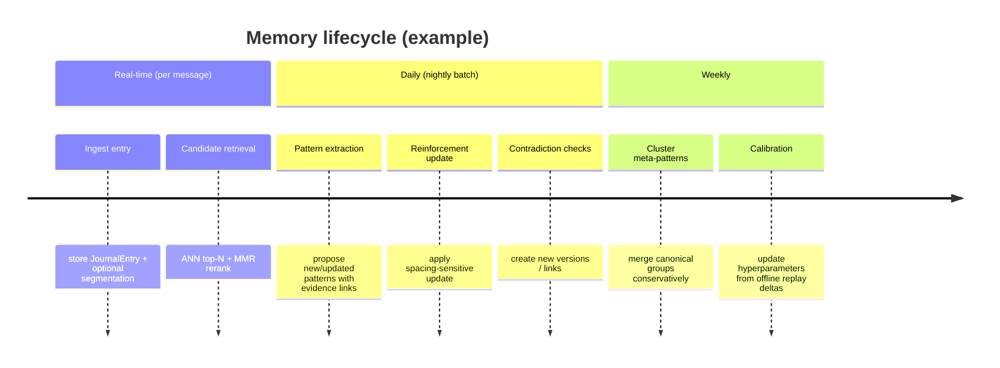

# Evidence‑Based Long‑Term Memory Architecture for a Pattern‑Storing Conversational Journal Assistant

## Executive summary

This report proposes an evidence‑based long‑term memory (LTM) architecture for a conversational journal assistant operating via entity["company","Telegram","messaging app"]. The core design choice is to store and retrieve **PATTERNS** (recurring themes/insights/behaviors) rather than conversation summaries. This aligns with well‑supported cognitive accounts in which episodic traces support later abstraction into schema‑like, gist‑level representations, while maintaining separable evidence links for accuracy and update. citeturn3search3turn8search13

Your current retrieval score  
**cosine_similarity × log(strength × 0.95^days_since_last_seen + 1)**  
is a reasonable engineering heuristic (semantic relevance + diminishing returns), and resembles practical LLM‑agent memory scoring that mixes relevance/recency/importance. citeturn2search4  
However, it is not theoretically faithful to key empirical findings: accessibility depends on **the full history of exposures**, including spacing; forgetting functions are difficult to distinguish, and human/agent memory shows fast initial decay with longer‑tail retention; and updating requires explicit handling of contradiction and temporal drift. citeturn0search4turn5search2turn1search1

I recommend replacing the single “strength” with two coupled quantities: **accessibility** (fast‑changing, recency‑sensitive) and **stability/confidence** (slow‑changing, evidence‑sensitive), and using either (a) an ACT‑R‑style base‑level activation (power‑law over all reference times) or (b) a dual‑timescale exponential approximation (fast + slow traces) for streaming updates. citeturn0search21turn6search6  
Contradiction/change should be represented via **versioned patterns** with validity intervals and typed edges (contradicts/supersedes), and emotional memory should be stored with separate affective fields and more conservative inference rules. citeturn3search2turn5search0turn5search0turn5search0

Evaluation should use **offline replay** of chronological interactions with ablations and metrics spanning retrieval (precision@k), temporal correctness, contradiction rate, response consistency, and memory‑conditioned hallucination/unsupported‑claim rate; modern benchmarks for long‑term conversational memory (LOCCO, PerLTQA, RMM settings) provide starting points. citeturn1search1turn1search0turn1search2

## System goals, constraints, and key design dimensions

### What is specified vs unspecified

**Specified (from your system context):**
- Memory unit = **pattern** with fields: `content, embedding, strength, times_seen, first_seen, last_seen`.
- Patterns can link to journal entries and be reinforced during compaction.
- Retrieval score: `cosine_similarity * log(strength * decay(days_since_last_seen) + 1)`.
- Decay: `0.95^days_since_last_seen`.

**Unspecified (must be clarified later; do not assume):**
- Embedding model family/version (and whether it can change over time).
- Vector index type (e.g., HNSW parameters, filtered search requirements) and latency targets.
- Storage budget (patterns, evidence links, version history, per‑user shard size).
- Compaction cadence (per message, nightly, weekly) and allowable compute.
- Privacy posture (on‑device vs server), encryption, retention/delete guarantees, regulatory constraints.
- Whether the assistant must provide **evidence citations** back to the user in responses (important for hallucination control).
- Target task mix (pure journaling vs coaching vs structured planning) and safety policy constraints.

### Key attributes/dimensions to consider (explicit checklist)

These dimensions determine feasible scoring/updates and are common failure points in long‑term memory systems:

1. **Update cost per message** (O(1) vs O(log N) vs O(N) per pattern) and compaction batch cost.
2. **Retrieval latency** under approximate nearest neighbor (ANN) search and re‑ranking. citeturn7search3
3. **ANN recall vs cost tradeoff** (index params influence which memories are even considered). citeturn7search3
4. **Storage cost**: embeddings + evidence pointers + version graph. (Versioning can dominate storage if not capped.)
5. **Explainability**: ability to answer “why did you remember this?” via linked evidence and confidence.
6. **Privacy/sensitivity**: per‑pattern sensitivity labels, retention policy, user deletion, redaction.
7. **Ability to version** and maintain temporal validity (avoid destructive overwrite).
8. **Contradiction tolerance**: coexistence of conflicting patterns and resolution at retrieval time.
9. **Embedding drift** risk (if embedding model changes, cosine neighborhoods shift; requires migration strategy — unspecified).
10. **Dedup/merge robustness**: avoid collapsing distinct temporal versions into one “average”.
11. **Emotional safety**: avoid over‑pathologizing; separate affective traces from factual claims. citeturn5search0turn5search9
12. **Calibration surface**: how many hyperparameters and how you will fit them (offline replay, Bayesian optimization, etc.). citeturn6search6turn1search1

## Evidence synthesis addressing the research questions

This section answers Q1–Q9 explicitly (bold labels), with conflicts/tradeoffs and evidence levels.

**Q1) Is the current scoring function theoretically and empirically sound?**  
Your function combines (i) dense semantic similarity and (ii) diminishing returns via log(·), plus (iii) a recency decay depending only on `days_since_last_seen`. This is **engineering‑plausible** and broadly consistent with LLM agent architectures that score memories by relevance × recency × importance, then retrieve top‑k. citeturn2search4turn1search3  
The main theoretical weakness is that it collapses the exposure history into `strength` and `last_seen`, ignoring classic findings that accessibility reflects **frequency, recency, and spacing** across *all* prior uses. ACT‑R’s base‑level learning formalizes this as a log of a sum over past references with power‑law decay, derived from rational/adaptive memory arguments. citeturn0search4turn0search21  
Empirically, modern LLM long‑term memory evaluations show memory persistence changes with rehearsal strategies and timing; “excessive rehearsal” can fail to help, indicating simple linear reinforcement is not robust across regimes. citeturn1search1  
**Conclusion:** the current scoring is a reasonable baseline (**moderate evidence**) but not theoretically grounded enough for long‑horizon personal memory with change/contradiction (**strong evidence** for needing history‑sensitive and update‑aware scoring). citeturn0search21turn1search1

**Q2) Should forgetting follow exponential decay, power‑law decay, or hybrid?**  
Classic and large‑scale fits across many retention datasets suggest multiple functions (logarithmic, power, variants of exponential) can fit well, and distinguishing them is often statistically difficult. citeturn5search2turn0search19  
The **practical implication** is that choosing “pure exponential” is rarely uniquely justified by data; yet exponential is attractive because it supports simple streaming updates and is widely used in agent memory baselines. citeturn1search3turn2search4  
Power‑law‑like tails arise naturally in ACT‑R base‑level activation (sum of power decays over references), which captures long‑tail accessibility and spacing effects. citeturn0search21turn6search6  
**Tradeoff:** power‑law models are more cognitively faithful but require storing (or approximating) exposure history; exponential models are cheaper but can over‑forget stable patterns unless “strength” becomes a hidden patch. citeturn0search21turn5search2  
**Recommendation:** a **hybrid** (dual timescale exponential or ACT‑R power‑law) is best supported for engineering + realism (**strong evidence** for hybrid necessity; **moderate evidence** on which hybrid variant is optimal for your data). citeturn0search21turn1search3turn5search2

**Q3) How should reinforcement be modeled (linear, log, saturating, Bayesian)?**  
Spacing and retrieval practice literatures show robust benefits of **distributed practice** and **retrieval** over restudy, with effects depending on lag and retention interval. citeturn0search2turn6search1turn6search11  
ACT‑R‑family models extend base‑level learning to capture spacing effects and can compute optimized practice schedules; critically, they imply **diminishing returns** and spacing‑dependent gains rather than linear add‑1 reinforcement. citeturn6search6turn0search21  
In LLM long‑term memory evaluation, rehearsal helps but “too much rehearsal” is not always effective, suggesting saturation/caps (and possibly interference) matter. citeturn1search1  
Bayesian updates are attractive for **confidence** in pattern truth (not the same as accessibility), especially under contradiction and change, but require careful likelihood design and can misbehave if the model generating “evidence” is noisy. This is best treated as a confidence layer rather than the sole strength model (**moderate evidence**). citeturn3search2turn1search2  
**Recommendation:** use **saturating, spacing‑sensitive reinforcement for accessibility** + **probabilistic/confidence update for stability** (**strong evidence** for saturation/spacing; **moderate evidence** for Bayesian confidence). citeturn0search2turn6search6turn1search1

**Q4) What memory granularity works best: turn/session/segment/pattern/hierarchy?**  
Cognitive frameworks distinguish fast episodic storage and slower semantic abstraction, supporting a two‑level (or hierarchical) memory. citeturn3search3turn8search13  
In LLM agent systems, storing a detailed “memory stream” plus synthesizing higher‑level reflections improves believability and behavior generation; this is a practical demonstration of hierarchical abstraction. citeturn2search4  
For long‑term personalized dialogue, rigid granularity (fixed turns/sessions) can fragment semantic structure; multi‑granularity prospective + retrospective reflection improves metrics across benchmarks. citeturn1search2  
**Recommendation:** **hierarchy**: journal entry → segments (optional) → pattern → meta‑pattern/topic cluster (**strong evidence**). citeturn3search3turn2search4turn1search2

**Q5) How should contradiction and change‑over‑time be represented?**  
Reconsolidation research shows reactivated memories can become labile, and prediction error/incomplete reminders can drive updating; this motivates designs that **update without erasing** and explicitly track competing hypotheses. citeturn3search1turn3search2  
In dialogue memory benchmarks, systems must handle updates and abstain when uncertain; designs that cite evidence and refine retrieval help manage contradictions (but still require explicit representation). citeturn4search0turn1search2  
**Recommendation:** represent patterns as **versioned hypotheses** with validity windows and typed edges `contradicts/supersedes`, plus confidence and evidence provenance (**moderate‑to‑strong evidence**). citeturn3search2turn4search0

**Q6) How should emotional memory differ from factual memory?**  
Emotional arousal modulates consolidation via amygdala interactions and affects encoding/retrieval; emotional memory shows systematic effects and can interact with attention/competition, producing enhancements and impairments depending on conditions. citeturn3search0turn5search0turn5search9  
Therefore emotional “importance” is not a simple scalar; it can bias what is remembered and how strongly. citeturn5search9turn5search0  
**Recommendation:** store **separate affective traces** (valence/arousal, triggers, emotion confidence) and apply conservative inference rules (avoid generating clinical claims), while keeping factual claims grounded in evidence links (**strong evidence** for separability; **moderate evidence** for exact parameterization/decay). citeturn3search0turn5search0turn5search9

**Q7) How to model temporal patterns (seasonality, weekly cycles, recency bursts)?**  
Temporal context models explain recency/contiguity via drifting context representations and retrieval of prior contextual states; this supports explicitly encoding time context in retrieval. citeturn2search3turn2search7  
In practice, LLM long‑term memory degrades over time and is sensitive to the ordering/position of relevant information in long contexts; this supports recency‑aware retrieval and careful memory injection ordering. citeturn1search1turn4search2  
Seasonality/weekly cycles in journaling are plausible but are more application‑specific than strongly established in LLM memory literature.  
**Recommendation:** treat temporal modeling as layered: (i) recency/history (strong), (ii) short‑cycle features (day‑of‑week/time‑of‑day histograms) (moderate), (iii) seasonality/burst models as optional (speculative unless validated on your logs). citeturn2search3turn1search1

**Q8) Best practices for dedup/merge of semantically equivalent memories?**  
Information retrieval work shows redundancy harms ranked lists; maximal marginal relevance (MMR) reduces redundancy while maintaining relevance. citeturn2search13  
For near‑duplicate detection, MinHash/resemblance methods provide efficient candidate generation for lexical overlap and de‑duplication at scale. citeturn2search14  
In a personal memory setting, naive merge on embedding similarity risks collapsing temporally distinct versions (pre‑/post‑change) into one “average”. This follows from the need to represent updates (Q5). citeturn3search2turn4search0  
**Recommendation:** a **two‑stage dedup/merge**: (1) candidate generation (embedding + optional MinHash for exact/near‑exact), (2) conservative semantic equivalence check + temporal/version guardrails; apply MMR at retrieval time for diversity (**strong evidence** for redundancy control; **moderate evidence** for semantic/temporal merge heuristics). citeturn2search13turn2search14turn3search2

**Q9) What evaluation benchmarks and metrics should be used?**  
For long‑term memory in dialogue/QA, PerLTQA provides memory classification/retrieval/fusion tasks over episodic + semantic memory categories. citeturn1search0turn1search8  
LOCCO evaluates LLM long‑term memory over chronological conversations and reports memory decay and rehearsal effects, directly relevant to scoring/forgetting/refinement choices. citeturn1search1turn1search5  
RMM evaluates memory management with multi‑granularity reflections and evidence‑based refinement, relevant to compaction policies. citeturn1search2turn1search10  
If your agent also uses long‑context prompting, long‑context benchmarks (LongBench, L‑Eval) and “Lost in the Middle” highlight failure modes when relevant information is buried; this matters for how you inject retrieved patterns/evidence into prompts. citeturn4search1turn4search3turn4search2  
**Recommendation:** use a combined suite: (i) offline replay on your own logs, (ii) PerLTQA + LOCCO for standardized comparisons, and (iii) long‑context stress tests if applicable (**strong evidence**). citeturn1search1turn1search0turn4search2

## Design recommendations table

Evidence labels apply to the **recommended choice** (Strong / Moderate / Speculative). “Evidence” column cites primary sources that motivate the choice.

| Decision | Options considered | Evidence (primary) | Recommended choice | Why (incl. evidence level, tradeoffs, failure modes) |
|---|---|---|---|---|
| Retrieval scoring structure | Multiply terms (current) vs additive normalized vs ACT‑R activation‑based | ACT‑R base‑level activation captures frequency+recency across references citeturn0search21turn6search6; LLM agent scoring uses recency/relevance/importance citeturn2search4turn1search3 | Use **gated relevance × activation**, not pure product of (strength×last_seen) | **Strong evidence.** Captures spacing/history and allows explicit penalties for contradiction/invalidity. Tradeoff: needs more state than `last_seen`. Failure mode: if history approximation is poor, activation misestimates and can resurrect outdated patterns. citeturn0search21turn3search2 |
| Forgetting function | Exponential (single) vs power‑law vs hybrid | Many functions fit retention; hard to distinguish citeturn5search2turn0search19; ACT‑R implies power‑law‑like activation over references citeturn0search21; MemoryBank uses exponential forgetting in LLM memory citeturn1search3 | Hybrid: **ACT‑R power‑law** if you can store history; else **dual‑timescale exponential** | **Strong evidence** that pure single exponential is often insufficient; **moderate** on which hybrid wins for your logs. Tradeoff: ACT‑R more faithful but heavier; dual‑exp streaming‑friendly but may still mis-handle long tails. citeturn5search2turn0search21 |
| Reinforcement model | Linear times_seen; log; saturating; Bayesian | Distributed practice meta‑analysis supports spacing effects citeturn0search2; retrieval practice benefits citeturn6search1; ACT‑R spacing/scheduling model citeturn6search6; LOCCO: rehearsal helps but excessive rehearsal not effective citeturn1search1 | **Saturating + spacing‑sensitive update** for accessibility; **probabilistic confidence** for stability | **Strong evidence** for spacing/saturation; **moderate** for Bayesian confidence as engineered uncertainty. Failure mode: if “reinforcement” detector is noisy, you inflate wrong patterns; mitigate by weighting explicit evidence higher (see schema). citeturn1search1turn6search6 |
| Memory granularity | Turn/session summaries; segments; patterns only; hierarchy | Complementary learning systems support episodic vs semantic separation citeturn3search3; generative agents show stream + reflections citeturn2search4; RMM shows multi‑granularity reflection improves citeturn1search2 | **Hierarchical memory**: evidence (journal entries) + patterns + clusters/meta‑patterns | **Strong evidence.** Provides traceability and abstraction. Tradeoff: complexity and storage. Failure mode: over‑abstracting too early can lock in wrong generalizations; mitigate via low confidence until enough evidence and versioning. citeturn8search13turn3search2 |
| Contradiction & change | Overwrite; keep both unlinked; version graph | Reconsolidation & prediction error drive updating citeturn3search1turn3search2; long‑term memory benchmarks require update/abstention abilities citeturn4search0turn1search1 | **Versioned patterns** with validity windows + typed edges (`contradicts`, `supersedes`) | **Moderate‑to‑strong evidence.** Tradeoff: retrieval must choose among versions. Failure mode: version explosion; mitigate with compaction rules and maximum versions per canonical group. citeturn3search2turn1search2 |
| Emotional vs factual memory | Single channel vs separate affective fields vs separate store | Amygdala modulation of emotional consolidation citeturn3search0turn5search0; arousal‑biased competition explains enhancement/impairment conditions citeturn5search9 | Separate affective trace fields + conservative inference policy | **Strong evidence** for affective modulation. Tradeoff: added complexity and safety policy needs. Failure mode: “emotional salience” can dominate retrieval; mitigate via caps and task‑dependent routing (empathy vs factual QA). citeturn5search0turn5search9 |
| Temporal patterns | Only recency; explicit time context; seasonal models | Temporal context model supports time context in retrieval citeturn2search7turn2search3; LOCCO shows time‑dependent decay in LLM memory citeturn1search1 | Add day‑of‑week / time‑of‑day histograms + burst features; seasonality optional | **Moderate evidence** for context features; **speculative** for richer seasonality unless validated. Failure mode: spurious cycles from sparse data; mitigate via confidence thresholds and shrinkage. citeturn2search7turn1search1 |
| Dedup/merge | Threshold cosine; clustering; MMR; MinHash | MMR reduces redundancy while preserving relevance citeturn2search13; MinHash for near‑duplicate detection citeturn2search14 | Two‑stage dedup + MMR at retrieval | **Strong evidence** for redundancy control. Tradeoff: semantic equivalence is hard; failure mode: merging across temporal changes—guard with validity/version checks. citeturn2search13turn3search2 |
| ANN retrieval constraints | Exact search; HNSW; other ANN | HNSW provides efficient approximate KNN with tradeoffs citeturn7search3turn7search7; dense retrieval metrics/top‑k recall framing citeturn7search1 | Use ANN (e.g., HNSW) + re‑rank (MMR / contradiction penalties) | **Strong evidence** that ANN tradeoffs matter for which memories are reachable. Failure mode: ANN misses rare patterns; mitigate via periodic exact audit on samples and multi‑probe settings. citeturn7search3turn7search1 |
| Evaluation suite | Only manual; only benchmarks; hybrid | PerLTQA and LOCCO provide public long‑term memory tasks/datasets citeturn1search0turn1search1; L‑Eval/LongBench and Lost‑in‑the‑Middle expose long‑context failures citeturn4search3turn4search2turn4search1 | Offline replay + ablations + PerLTQA/LOCCO + long‑context stress (if used) | **Strong evidence.** Failure mode: benchmark mismatch with journaling; mitigate by creating a gold set from your own logs and measuring evidence‑grounding. citeturn1search1turn1search0 |

## Proposed scoring formulas with assumptions and failure modes

This section provides 3 alternatives (you asked for 2–3). Each is compatible with “pattern” memory, keeps cosine similarity, and adds explicit update/uncertainty handling.

### Alternative A: ACT‑R‑style base‑level activation + validity/confidence gates

**Motivation (theory):** Base‑level learning in ACT‑R models accessibility as a function of the entire reference history, capturing frequency/recency and producing power‑law‑like forgetting. citeturn0search21turn0search9  
**Motivation (engineering):** Captures spacing without hand‑tuned decay constants; aligns with “adaptive memory” arguments. citeturn0search4turn5search7

Let a pattern \(p\) have reinforcement events at times \(t_1,\dots,t_n\). Define:
\[
A(p)=\ln\Big(\sum_{j=1}^{n} (\Delta t_j + \tau)^{-d}\Big)
\]
where \(\Delta t_j = \text{now}-t_j\), \(\tau>0\) avoids singularities, and \(d\in(0,1)\) controls decay. citeturn0search21

Define a confidence/stability term \(C(p)\in[0,1]\) (see schema). Validity gate \(V(p)\in[0,1]\) based on whether the pattern is “active” vs “superseded/disputed”.

Final score:
\[
\text{Score}(p\mid q)=\text{cos}(e_q,e_p)\cdot \sigma(\beta_0+\beta_1 A(p))\cdot C(p)\cdot V(p)\cdot (1-\gamma\cdot R_\text{contr}(p,q))
\]
- \(R_\text{contr}\) = contradiction risk for the current query context (0–1); \(\gamma\) is penalty weight.
- \(\sigma\) prevents extreme scaling issues vs multiplying raw activations.

**Suggested parameter ranges (calibrate, do not hardcode):**
- \(d\) commonly around ~0.3–0.7 in ACT‑R applications; noise scaling often cited around ~0.25 in ACT‑R tutorials (contextual, depends on task). citeturn0search9turn0search21  
- \(\tau\) can be 1 hour–1 day in your time units to avoid “infinite” activation from very recent events (engineering choice; validate offline). (Unspecified optimal value.)

**Assumptions:**
- You can store either the list of reinforcement timestamps or an approximation sufficient to compute \(A(p)\).
- Reinforcement events are reasonably detected (explicit vs implicit vs inferred).

**Failure modes / tradeoffs:**
- **History storage cost:** Storing all timestamps can become expensive; consider compressing (e.g., keep last K + logarithmic bucketing). (Evidence: model requires history; engineering tradeoff.)
- **Version confusion:** High activation can keep old versions alive; must combine with validity windows and `superseded_by`. citeturn3search2turn4search0
- **Noisy reinforcement:** If you “reinforce” on weak signals, spurious patterns gain activation; require evidence weighting (see schema). citeturn1search1

**Evidence label:** **Strong evidence** (ACT‑R base‑level learning as a primary, theory‑driven model; plus spacing‑aware extensions). citeturn0search21turn6search6

### Alternative B: Dual‑timescale exponential traces (streaming‑friendly hybrid)

**Motivation:** Many retention curves show fast initial drop with longer tail; hybrid exponentials approximate this while supporting O(1) updates. citeturn5search2turn1search3

Maintain two state variables per pattern: \(S_f\) (fast) and \(S_s\) (slow).

Update upon reinforcement after \(\Delta t\) days:
\[
S_f \leftarrow S_f\cdot e^{-\lambda_f\Delta t} + w(\Delta t)
\]
\[
S_s \leftarrow S_s\cdot e^{-\lambda_s\Delta t} + \eta\cdot w(\Delta t)
\]
where \(w(\Delta t)\) is a spacing‑sensitive reinforcement increment (e.g., saturating function below), and \(\lambda_f\gg\lambda_s\).  
Accessibility proxy: \(A = \alpha_f S_f + \alpha_s S_s\).

Score:
\[
\text{Score}(p\mid q)=\text{cos}(e_q,e_p)\cdot \log(1+A)\cdot C(p)\cdot V(p)
\]

A simple spacing‑sensitive increment:
\[
w(\Delta t)=w_{\max}\cdot(1-e^{-\Delta t/\kappa})
\]
This encodes **diminishing returns for massed rehearsal** and larger gains when the interval is longer, consistent with distributed practice effects. citeturn0search2turn6search11

**Concrete starting points (must calibrate):**
- Choose half‑lives: fast = 3–14 days; slow = 30–180 days (journal‑dependent; unspecified).  
Convert to \(\lambda = \ln 2 / \text{half-life}\).

**Assumptions:**
- You want O(1) state per pattern and fast updates; you may not store full reinforcement history.

**Failure modes / tradeoffs:**
- **Parameter sensitivity:** wrong half‑lives cause either amnesia or clutter.
- **Burst domination:** a short intense burst can inflate \(S_f\); mitigate by saturating \(w_{\max}\) and/or capping \(S_f\).
- **Weaker spacing fidelity vs ACT‑R:** approximates long tails but may not model fine‑grained spacing interactions. citeturn6search6turn0search2

**Evidence label:** **Moderate evidence** (hybrid decay is supported; exact dual‑exp form is an engineering approximation). citeturn5search2turn1search1

### Alternative C: Relevance × expected utility with Bayesian confidence + hazard for change

**Motivation:** In journaling, “truth” and “current applicability” are distinct. A Bayesian layer supports calibrated confidence under contradictory evidence and change. Prediction‑error/reconsolidation work motivates update mechanisms rather than overwrite. citeturn3search2turn3search1

Let each pattern version \(p_v\) maintain a Beta‑Bernoulli belief over whether it currently holds:
- Prior: \(\text{Beta}(\alpha_0,\beta_0)\) (if unspecified, choose weakly informative).
- Each supporting evidence increments \(\alpha\) weighted by reliability; each contradiction increments \(\beta\).

Let \(P=\mathbb{E}[\theta]=\alpha/(\alpha+\beta)\) be confidence.

Model change with a hazard \(h\) (probability per unit time the pattern stops being valid). Validity decays as:
\[
V(t)=e^{-h\Delta t}
\]
Score:
\[
\text{Score}(p_v\mid q)=\text{cos}(e_q,e_{p_v})\cdot \log(1+\text{Access}(p_v))\cdot P(p_v)\cdot V(t)
\]

**Assumptions:**
- You can assign evidence reliability classes (explicit self‑statement > implicit inference), and maintain versions.

**Failure modes / tradeoffs:**
- **Likelihood misspecification:** if your “evidence detector” is biased, posterior confidence becomes misleading.
- **Hazard choice:** setting \(h\) wrong creates too‑rapid invalidation or stale persistence.
- **Complexity:** more moving parts than necessary; keep as optional “confidence layer” atop A/B.

**Evidence label:** **Moderate evidence** for probabilistic confidence as an engineering layer; **strong evidence** that updates and prediction‑error‑driven change matter. citeturn3search2turn4search0turn1search2

### Visual comparison of decay behaviors (example)

Below is a simple comparison showing how your current decay (0.95^d) differs from a power‑law and a dual‑timescale hybrid. Values are illustrative, not fit to your data.

| Days since last reinforcement | Exponential 0.95^d | Power‑law (1/(1+d)^0.5) | Power‑law (1/(1+d)^1.0) | Dual‑exp example (0.6·e^{-d/7}+0.4·e^{-d/90}) |
|---:|---:|---:|---:|---:|
| 1 | 0.950 | 0.707 | 0.500 | 0.6·0.868 + 0.4·0.989 ≈ 0.916 |
| 7 | 0.698 | 0.354 | 0.125 | 0.6·0.368 + 0.4·0.925 ≈ 0.591 |
| 30 | 0.214 | 0.179 | 0.032 | 0.6·0.014 + 0.4·0.717 ≈ 0.295 |
| 90 | 0.010 | 0.105 | 0.011 | 0.6·0.000003 + 0.4·0.368 ≈ 0.147 |

Key takeaway: single exponentials can become very small quickly (your 0.95^90 ≈ 0.01), which may be too aggressive for stable personal patterns unless “strength” grows to compensate.

## Concrete JSON schema proposal, compaction prompt, and dedup/merge policy

This section covers Deliverables D and E.

### Memory object relationships (mermaid)

```mermaid
graph TD
  JE[JournalEntry] -->|contains| SEG[Segment (optional)]
  SEG -->|evidence_for| EV[EvidenceLink]
  JE -->|evidence_for| EV
  EV -->|supports / contradicts / updates| PV[PatternVersion]
  PV -->|member_of| CG[CanonicalPatternGroup]
  PV -->|supersedes| PV2[PatternVersion]
  PV -->|contradicts| PV3[PatternVersion]
  CG -->|has_current| PV
```

This design operationalizes “patterns over summaries” while preserving evidence‑grounding: it resembles hierarchical “stream + reflections” architectures in LLM agents and multi‑granularity memory management in personalized dialogue systems. citeturn2search4turn1search2

### Pattern schema (JSON)

You requested: include contradiction, confidence, temporal and emotional fields; also include example instances. The schema below is a superset of your current fields; you can implement it incrementally.

```json
{
  "pattern_id": "uuid",
  "canonical_group_id": "uuid",
  "version": 3,

  "content": "I tend to feel anxious on Sunday evenings before the work week.",
  "embedding": [0.012, -0.034, "..."],

  "pattern_type": "habit | preference | fact | insight | goal | relationship | emotion_state",
  "scope": "self | other | shared",
  "tags": ["anxiety", "weekly_cycle", "work"],

  "accessibility": {
    "model": "actr_power | dual_exp",
    "times_seen": 14,
    "first_seen": "2025-05-02T21:10:00+02:00",
    "last_seen": "2026-02-21T22:05:00+01:00",

    "history": {
      "reinforcement_timestamps": ["2026-02-21T22:05:00+01:00", "2026-02-14T21:57:00+01:00"],
      "compressed": true,
      "compression_method": "keep_last_k_plus_log_bins"
    },

    "dual_exp_state": {
      "fast": 3.14,
      "slow": 8.92,
      "lambda_fast": 0.10,
      "lambda_slow": 0.01
    }
  },

  "stability": {
    "confidence": 0.78,
    "confidence_model": "beta",
    "alpha": 7.0,
    "beta": 2.0,
    "evidence_count": 11,
    "contradiction_count": 2,
    "last_validated": "2026-02-21T22:05:00+01:00"
  },

  "validity": {
    "status": "active | disputed | superseded | dormant",
    "valid_from": "2025-05-02T21:10:00+02:00",
    "valid_to": null,
    "hazard_rate_per_day": 0.002
  },

  "evidence": [
    {
      "journal_entry_id": "uuid",
      "timestamp": "2026-02-21T22:05:00+01:00",
      "span": "I’m getting that familiar Sunday-night anxiety again.",
      "polarity": "supports",
      "signal": "explicit",
      "weight": 1.0
    }
  ],

  "contradiction_and_change": {
    "supersedes": ["uuid-old-version"],
    "superseded_by": null,
    "contradicts": [
      {
        "pattern_id": "uuid-other",
        "type": "soft | hard | temporal",
        "note": "User reported reduced Sunday anxiety after changing job.",
        "detected_at": "2026-01-15T10:00:00+01:00"
      }
    ]
  },

  "emotion": {
    "valence": -0.6,
    "arousal": 0.7,
    "dominant_emotions": ["anxiety"],
    "trigger_cues": ["Sunday evening", "Monday work"],
    "emotion_confidence": 0.8,
    "policy": "avoid_clinical_inference"
  },

  "temporal": {
    "dow_hist": {"mon":0, "tue":1, "wed":0, "thu":0, "fri":1, "sat":0, "sun":9},
    "tod_hist": {"night":8, "morning":0, "afternoon":1, "evening":2},
    "burst": {
      "ema_7d": 0.8,
      "ema_30d": 0.4,
      "last_burst_at": "2026-02-21T22:05:00+01:00"
    },
    "seasonality_hint": "weekly"
  },

  "privacy": {
    "sensitivity": "high",
    "retention_policy": "user_deleteable",
    "redaction_required": true
  }
}
```

**Why these fields are evidence‑based:**  
- The evidence list + abstraction into patterns mirrors proven “stream + reflection” designs in LLM agents and multi‑granularity reflection systems. citeturn2search4turn1search2  
- Confidence and update mechanisms align with reconsolidation/prediction‑error perspectives on memory change (update rather than overwrite). citeturn3search2turn3search1  
- Emotional modulation justifies separating affect from factual claims. citeturn3search0turn5search9  
- Temporal context is motivated by temporal context models and time‑dependent LLM memory results. citeturn2search7turn1search1

### Example compaction/extraction prompt (with JSON output schema)

You asked for an example prompt and JSON schema. Below is a production‑style prompt designed to minimize hallucinated memories and enforce evidence linking.

```text
SYSTEM:
You are the Memory Compaction Module for a personal journaling assistant.
Your job: extract/maintain PATTERNS (recurring themes/insights/behaviors) grounded in evidence.
Rules:
- Output MUST be valid JSON matching the provided schema.
- Do NOT invent facts. Every created/updated pattern must include ≥1 evidence link to a journal_entry_id.
- If new information contradicts an existing pattern, do NOT overwrite silently.
  Create a new version and link via supersedes/contradicts, updating confidence accordingly.
- Separate factual content from emotional content. Do not infer diagnoses or clinical labels.
- Prefer explicit user statements over implicit inferences.

USER:
now = "2026-02-22T09:30:00+01:00"

new_journal_entries = [
  {
    "journal_entry_id":"e1",
    "timestamp":"2026-02-21T22:05:00+01:00",
    "text":"I’m getting that familiar Sunday-night anxiety again. It always spikes before Monday."
  },
  {
    "journal_entry_id":"e2",
    "timestamp":"2026-02-20T18:10:00+01:00",
    "text":"Finished a good week. Felt calmer than usual."
  }
]

retrieved_candidate_patterns = [
  {
    "pattern_id":"p10",
    "canonical_group_id":"g3",
    "version":2,
    "content":"I often feel anxious on Sunday evenings before the work week.",
    "validity":{"status":"active"},
    "stability":{"confidence":0.72}
  }
]

TASK:
Return JSON actions to create/reinforce/update/version/merge patterns.
Also return any dedup/merge decisions and contradiction links.
Schema:
{
 "actions":[
   {
     "action":"create|reinforce|new_version|merge|mark_contradiction|mark_dormant",
     "pattern_id":"string|null",
     "target_pattern_id":"string|null",
     "canonical_group_id":"string|null",
     "proposed_content":"string|null",
     "pattern_type":"string|null",
     "evidence_links":[{"journal_entry_id":"string","timestamp":"string","span":"string|null","polarity":"supports|contradicts|updates","weight":0.0}],
     "confidence_update":{"new_confidence":0.0,"rationale":"string"},
     "validity_update":{"status":"active|disputed|superseded|dormant","valid_from":"string|null","valid_to":"string|null"},
     "emotion_update":{"valence":0.0,"arousal":0.0,"dominant_emotions":["string"],"trigger_cues":["string"]},
     "temporal_update":{"dow":"mon|tue|wed|thu|fri|sat|sun","tod":"night|morning|afternoon|evening"},
     "dedup":{"merge_candidate_ids":["string"],"decision":"merge|no_merge","reason":"string"},
     "contradiction":{"contradicts_pattern_id":"string|null","type":"soft|hard|temporal","note":"string|null"}
   }
 ],
 "errors":[]
}
```

**Why this prompt structure is evidence‑aligned:** It forces grounding (evidence links) and explicit management of multi‑granularity memory/refinement, reflecting lessons from memory management in long‑term dialogue settings and evidence‑based refinement mechanisms. citeturn1search2turn1search1

### Dedup/merge policy (best practices)

Implement dedup/merge as **two different mechanisms**:

**Dedup at storage time (prevent database bloat):**
1. **Candidate generation**
   - Embedding ANN top‑N (e.g., HNSW index). citeturn7search3turn7search7  
   - Optional MinHash for near‑exact duplicates when you store textual pattern content. citeturn2search14
2. **Conservative merge rule**
   - Merge only if semantically equivalent AND not different temporal phases.  
   - If new evidence suggests a change, prefer **new version** and mark `supersedes` rather than merge.
3. **Canonical groups**
   - Maintain `canonical_group_id` so equivalent paraphrases group together without destroying version history.

**Dedup at retrieval time (avoid redundant top‑k):**
- Apply **MMR** re‑ranking (or another diversity‑promoting re‑ranker) on candidates after initial relevance scoring. citeturn2search13

**Failure modes & mitigations:**
- Over‑merge: loses nuance and destroys change‑over‑time; mitigate with validity/version checks. citeturn3search2turn4search0  
- Under‑merge: memory clutter and repeated retrieval of same idea; mitigate with canonical groups and MMR. citeturn2search13

Evidence level: **Strong** for redundancy control (MMR, MinHash); **Moderate** for the specific semantic equivalence thresholds, which must be calibrated on your data. citeturn2search13turn2search14turn1search1

## Experimental plan and reading list

This section covers Deliverables F and G.

### Offline replay setup

**Goal:** Evaluate pattern memory as a retrieval‑and‑update system over time, measuring whether the agent retrieves the right patterns, maintains consistency, and handles contradictions/updates.

**Data sources:**
- **Your private logs** (journal entries + assistant responses), anonymized and permissioned (unspecified data volume).
- Public benchmarks to triangulate:
  - **LOCCO / LOCCO‑L** (chronological conversations, memory persistence and rehearsal effects). citeturn1search1turn1search5  
  - **PerLTQA** (personal long‑term memory QA with episodic + semantic categories; retrieval and fusion). citeturn1search0turn1search8  
  - **RMM evaluation settings** (memory management via prospective/retrospective reflection across granularities). citeturn1search2turn1search10  
  - If your production prompt uses long contexts: **LongBench**, **L‑Eval**, and “Lost in the Middle” stress tests. citeturn4search1turn4search3turn4search2

**Replay protocol (chronological):**
1. Process entries in timestamp order.
2. At each step: run compaction/extraction → update memory store.
3. At predetermined checkpoints: run a fixed query suite that probes:
   - Stable patterns (should persist)
   - Updated patterns (should select newest version)
   - Contradictions (should abstain or explain uncertainty)
   - Emotional patterns (should trigger empathic but non‑clinical responses)
4. Log: top‑k retrieved patterns, evidence links used, final response, and whether response cites/grounds claims.

### Ablations (must be included)

Minimum ablation grid:
- **Scoring**
  - Current score vs Alternative A (ACT‑R) vs Alternative B (dual‑exp) vs Alternative C (confidence/hazard layer).
- **Forgetting**
  - Pure exponential 0.95^d vs calibrated exponential vs dual‑exp vs ACT‑R power‑law.
- **Reinforcement**
  - Linear increment vs saturating spacing‑sensitive increments; include a “cap” condition to test LOCCO‑style excessive rehearsal effects. citeturn1search1turn6search6
- **Granularity**
  - Patterns only (no hierarchy) vs evidence‑linked patterns vs patterns + clusters/meta‑patterns.
- **Contradiction handling**
  - Overwrite vs versioning + confidence; evaluate temporal correctness.
- **Dedup**
  - No MMR vs MMR; aggressive merge vs conservative versioned merge. citeturn2search13turn3search2
- **Prompt injection ordering (if long context)**
  - Random vs recency‑sorted vs relevance‑then‑MMR; evaluate “middle loss”. citeturn4search2

### Metrics (include requested ones) and operational definitions

**Retrieval quality**
- **Precision@k**: fraction of retrieved patterns in top‑k that are in a gold set for the query.
- **Recall@k**: fraction of gold patterns retrieved in top‑k.
- **nDCG@k**: graded relevance (useful if multiple patterns partially relevant).  
PerLTQA’s framing of retrieval/fusion tasks can guide gold labeling structure. citeturn1search0turn1search8

**Temporal and update correctness**
- **Temporal correctness**: did the agent retrieve the pattern version valid for the query timestamp?
- **Update latency**: number of interactions until a changed pattern is reflected as superseding.

**Contradiction metrics**
- **Contradiction rate** (requested): proportion of responses that contradict an “active” applicable pattern version or ignore a known contradiction link.
- **Abstention correctness**: when contradictions exist, does the agent appropriately hedge/ask/fail safe? (LongMemEval‑style tasks emphasize abstention, but peer‑review status may vary; treat as optional reference). citeturn4search0

**Response consistency**
- **Longitudinal consistency** (requested): consistency of stated preferences/habits across time windows, controlling for versioned updates (do not penalize correct change).

**Hallucination / unsupported memory claims**
- **Memory‑conditioned hallucination rate** (requested): percentage of responses that assert a pattern without any linked evidence in the retrieved set.  
This is directly motivated by evidence‑citing memory refinement and retrieval‑grounding practices in long‑term memory management work. citeturn1search2turn1search1

**Compute and operational metrics**
- Update time per compaction; retrieval latency; store size growth; ANN recall diagnostics (sample exact search comparisons). ANN tradeoffs matter because missed candidates cannot be recovered by scoring. citeturn7search3turn7search1

### Timeline for evaluation and compaction cadence (mermaid)

(Exact cadence is unspecified; below is an evaluable template.)



### Reading list grouped by theme (primary sources only)

URLs are provided in inline code to comply with formatting. Each entry includes a DOI or an official URL, plus a one‑line relevance note.

**Adaptive memory, forgetting functions, rational analysis**
- Anderson & Schooler (1991), DOI: 10.1111/j.1467-9280.1991.tb00174.x, URL: `https://journals.sagepub.com/doi/10.1111/j.1467-9280.1991.tb00174.x` — Connects memory accessibility to environmental use statistics; motivates history‑based scoring. citeturn0search0turn0search4  
- Rubin & Wenzel (1996), DOI: 10.1037/0033-295X.103.4.734, URL: `https://users.cs.northwestern.edu/~paritosh/papers/KIP/100YearsOfForgetting.pdf` — Large‑scale comparison of retention functions; shows multiple forms fit and are hard to distinguish. citeturn5search2  
- White (2001), DOI: 10.3758/BF03192887, URL: `https://link.springer.com/content/pdf/10.3758/BF03192887.pdf` — Reviews forgetting functions and interpretive issues; supports hybrid skepticism about single exponentials. citeturn0search19  
- McClelland, McNaughton & O’Reilly (1995), DOI: 10.1037/0033-295X.102.3.419, URL: `https://pubmed.ncbi.nlm.nih.gov/7624455/` — Complementary learning systems (episodic fast vs semantic slow), foundational for patterns + evidence architecture. citeturn3search3  
- Anderson & Milson (1989), DOI: 10.1037/0033-295X.96.4.703 — Adaptive perspective on memory; supports rational scoring approaches. citeturn5search7

**ACT‑R and spacing‑aware reinforcement**
- Lebiere (1999), URL: `https://act-r.psy.cmu.edu/wordpress/wp-content/uploads/2012/12/459459.pdf` — States ACT‑R base‑level activation \( \ln\sum t^{-d} \); direct template for accessibility modeling. citeturn0search21  
- Taatgen, Lebiere & Anderson (tutorial chapter), URL: `https://www.ai.rug.nl/~niels/publications/taatgenLebiereAnderson.pdf` — Practical ACT‑R parameterization notes (e.g., activation noise), useful for calibration starting points. citeturn0search9  
- Cepeda et al. (2006), PMID: 16719566, URL: `https://pubmed.ncbi.nlm.nih.gov/16719566/` — Meta‑analysis of distributed practice; supports spacing‑sensitive reinforcement rather than linear counts. citeturn0search2  
- Cepeda et al. (2008), PMID: 19076480, URL: `https://laplab.ucsd.edu/articles/Cepeda%20et%20al%202008_psychsci.pdf` — “Temporal ridgeline” of optimal spacing as retention interval grows; suggests parameter calibration strategies. citeturn6search11  
- Pavlik & Anderson (2008), PMID: 18590367, URL: `https://act-r.psy.cmu.edu/wordpress/wp-content/uploads/2012/12/791xap-14-2-101.pdf` — ACT‑R‑based model to compute optimal practice schedules; supports saturating/spacing‑by‑retention interactions. citeturn6search6turn6search18  
- Karpicke & Roediger (2008), DOI: 10.1126/science.1152408, URL: `https://www.science.org/doi/10.1126/science.1152408` — Retrieval practice improves long‑term retention; motivates reinforcing patterns through active recall/usage. citeturn6search1  
- Bjork & Bjork (1992) (book chapter), URL: `https://bjorklab.psych.ucla.edu/wp-content/uploads/sites/13/2016/07/RBjork_EBjork_1992.pdf` — “New theory of disuse”: distinguishes storage strength vs retrieval strength; maps cleanly to stability vs accessibility split. citeturn6search4

**Temporal context and time‑sensitive retrieval**
- Howard & Kahana (2002), DOI: 10.1016/S0022-2496(01)91388-4, URL: `https://memory.psych.upenn.edu/files/pubs/HowaKaha02.pdf` — Temporal Context Model; motivates encoding temporal context features beyond last_seen. citeturn2search3turn2search7

**Emotional memory and safe separation of affect vs facts**
- McGaugh (2004), DOI: 10.1146/annurev.neuro.27.070203.144157, URL: `https://pubmed.ncbi.nlm.nih.gov/15217324/` — Amygdala modulation of emotional memory consolidation; supports separate emotional fields and different decay/importance. citeturn3search0  
- LaBar & Cabeza (2006), DOI: 10.1038/nrn1825, URL: `https://pubmed.ncbi.nlm.nih.gov/16371950/` — Systems‑level account of emotional memory encoding/retrieval; supports dissociation and safety constraints. citeturn5search0  
- Mather & Sutherland (2011), DOI: 10.1016/j.tics.2011.06.002, URL: `https://pmc.ncbi.nlm.nih.gov/articles/PMC3110019/` — Arousal‑biased competition explains when arousal enhances vs impairs; warns against naive “emotion = importance”. citeturn5search9

**Memory updating, reconsolidation, contradiction handling**
- Nader, Schafe & LeDoux (2000), DOI: 10.1038/35021052, URL: `https://www.nature.com/articles/35021052` — Reconsolidation: retrieval can reopen memories for change; supports versioning rather than overwrite. citeturn3search1  
- Sinclair & Barense (2019), DOI: 10.1016/j.tins.2019.08.007, URL: `https://pubmed.ncbi.nlm.nih.gov/31506189/` — Prediction error and incomplete reminders drive updating; supports contradiction detection and confidence adjustments. citeturn3search2  
- Ritvo, Turk‑Browne & Norman (2019), DOI: 10.1016/j.tics.2019.06.007, URL: `https://pmc.ncbi.nlm.nih.gov/articles/PMC6698209/` — Nonmonotonic plasticity: retrieval can integrate or differentiate representations; motivates cautious merge policies. citeturn8search7

**LLM / dialogue long‑term memory systems and benchmarks (2018–2026 priority)**
- Park et al. (2023), DOI: 10.1145/3586183.3606763, URL: `https://3dvar.com/Park2023Generative.pdf` — Demonstrates memory stream + reflection + scoring by recency/relevance/importance; strong architectural reference for patterns. citeturn2search4turn2search8  
- Zhong et al. (2024) “MemoryBank”, DOI: 10.1609/aaai.v38i17.29946, URL: `https://ojs.aaai.org/index.php/AAAI/article/view/29946/31654` — Implements LLM long‑term memory with an exponential forgetting formulation; baseline for comparison. citeturn1search3turn1search15  
- Tan et al. (2025) “RMM”, DOI: 10.18653/v1/2025.acl-long.413, URL: `https://aclanthology.org/2025.acl-long.413/` — Multi‑granularity prospective/retrospective reflection and evidence‑based refinement; informs compaction design and online updates. citeturn1search2turn1search10  
- Jia et al. (2025) “LOCCO/LOCCO‑L”, DOI: 10.18653/v1/2025.findings-acl.1014, URL: `https://aclanthology.org/2025.findings-acl.1014/` — Chronological conversation benchmark; shows decay over time and limits of excessive rehearsal in LLMs. citeturn1search1turn1search5  
- Du et al. (2024) “PerLTQA”, DOI: 10.18653/v1/2024.sighan-1.18, URL: `https://aclanthology.org/2024.sighan-1.18/` — Dataset + tasks for memory classification/retrieval/fusion; useful for evaluating pattern retrieval + evidence fusion. citeturn1search0turn1search8

**Long‑context stress tests (if your prompt injects retrieved memories into long contexts)**
- Bai et al. (2024) “LongBench”, DOI: 10.18653/v1/2024.acl-long.172, URL: `https://aclanthology.org/2024.acl-long.172/` — Standardized long‑context benchmark; helps detect failures when memory evidence is long/complex. citeturn4search1turn4search9  
- An et al. (2024) “L‑Eval”, DOI: 10.18653/v1/2024.acl-long.776, URL: `https://aclanthology.org/2024.acl-long.776/` — Standardized long‑context evaluation and metric considerations; relevant if you rely on long prompt windows. citeturn4search3turn4search7  
- Liu et al. (2024) “Lost in the Middle”, DOI: 10.1162/tacl_a_00638, URL: `https://aclanthology.org/2024.tacl-1.9/` — Shows position‑sensitivity in long contexts; motivates ordering and summarizing retrieved memories. citeturn4search2turn4search6

**Dedup, redundancy control, ANN retrieval primitives**
- Carbonell & Goldstein (1998) “MMR”, DOI: 10.1145/290941.291025, URL: `https://www.cs.cmu.edu/~jgc/publication/The_Use_MMR_Diversity_Based_LTMIR_1998.pdf` — Redundancy‑aware re‑ranking; essential for diverse top‑k memories. citeturn2search13  
- Broder (1997) “Resemblance and containment of documents”, URL: `https://www.misserpirat.dk/main/docs/00000004.pdf` — MinHash foundations for efficient near‑duplicate detection. citeturn2search14  
- Malkov & Yashunin (2018/2020 TPAMI) “HNSW”, DOI: 10.1109/TPAMI.2018.2889473, URL: `https://www.computer.org/csdl/journal/tp/2020/04/08594636/17D45Xcttle` — ANN indexing tradeoffs directly affect reachable pattern recall/latency. citeturn7search7turn7search3  
- Karpukhin et al. (2020) “Dense Passage Retrieval”, DOI: 10.18653/v1/2020.emnlp-main.550, URL: `https://aclanthology.org/2020.emnlp-main.550/` — Formalizes dense retrieval evaluation (top‑k accuracy) and dense embedding indexing framing. citeturn7search1turn7search4